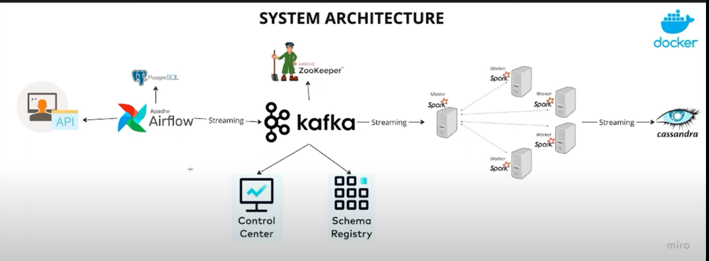
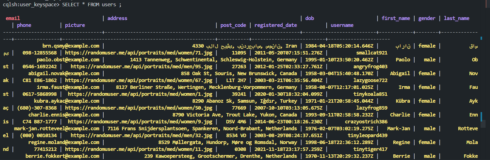

### Architecture

run the venv 
    `.\testenv\scripts\activate`
     `$env:PYSPARK_PYTHON = "python"`
start containers with:
    `docker-compose up -d`

run to start db
    `docker-compose run --rm airflow-webserver airflow db init`

run to create ur apache airflow account as login `admin` and password `admin`
    `docker-compose run --rm airflow-webserver airflow users create --username admin --firstname Admin --lastname User --role Admin --email admin@example.com --password admin`

    

### you have to run the producer twice cuz the first one time it creates the topic and for the second time it adds the message in messages

### to access the database u have to do this command
    `docker exec -it cassandra cqlsh`
   

### to run the spark file
    `spark-submit --packages org.apache.spark:spark-sql-kafka-0-10_2.12:3.5.0,com.datastax.spark:spark-cassandra-connector_2.12:3.4.1 spark_consumer.py`

## --packages ...
This downloads the needed connectors automatically:

    org.apache.spark:spark-sql-kafka-0-10_2.12:3.5.0
    → This lets Spark talk to Kafka.

    2.12: Scala version
    3.5.0: Spark version

    com.datastax.spark:spark-cassandra-connector_2.12:3.4.1
    → This lets Spark write to a Cassandra database.

## data in Cassandra is something like this

    
